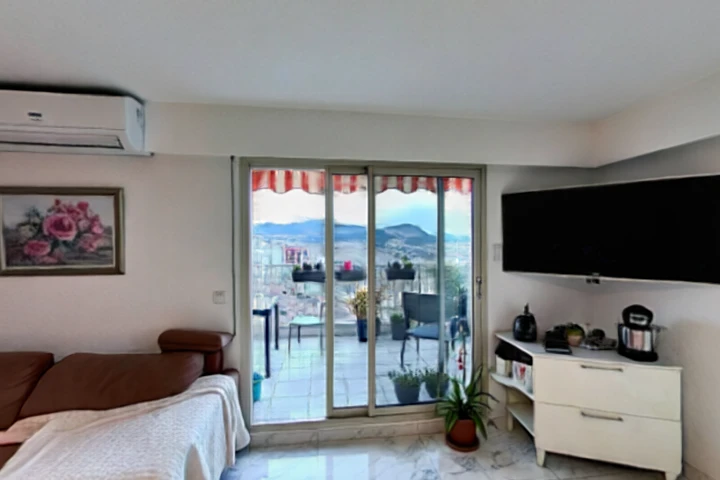

# pano-forge

**Photos (ou vidéo) d'une vraie pièce → monde 3D navigable, fidèle à la pièce.**


pano-forge transforme de vraies photos d'intérieur (ou une vidéo de marche dans
la pièce) en un **monde 3D explorable** — mesh, panorama équirectangulaire et
Gaussian splats — via l'API [World Labs Marble](https://marble.worldlabs.ai/).

L'idée centrale : la **fidélité par conditionnement image**. Plutôt que de
décrire la pièce en texte et d'en halluciner une version générique, on envoie
les **pixels réels** à World Labs, qui reconstruit le monde à partir de ce
qu'il voit.

---

## Installation

```bash
pip install -r requirements.txt
```

Python 3.11+. Le cœur du pipeline n'a besoin que de `gradio_client` et `Pillow`
(`numpy` pour la sélection par diversité) ; `opencv-python-headless` et `tqdm` ne
sont requis que pour `--mix`.

---

## Prérequis

| Variable | Requis pour | Détails |
|---|---|---|
| `WORLD_LABS_API_KEY` | **`--submit`** (toute génération) | Clé World Labs Marble. La génération est **payante** ([billing](https://platform.worldlabs.ai/billing)). |
| `HF_TOKEN` | `--backend dit360` uniquement | Token Hugging Face **gratuit**, relève le quota ZeroGPU du Space de caption. Optionnel. |

Sans `--submit`, pano-forge prépare seulement la requête (gratuit, hors-ligne) :
il sélectionne/assemble les sources et écrit le manifeste, sans appeler World Labs.

```bash
export WORLD_LABS_API_KEY="..."   # PowerShell : $env:WORLD_LABS_API_KEY="..."
```

---

## Les 4 modes d'utilisation

Chaque run écrit dans un sous-dossier dédié `output/<timestamp>/` (isolé,
comparable).

### 1. Photo unique (défaut) — `--submit`
La meilleure photo (résolution) → World Labs en `image_prompt`.

```bash
python -m src.forge input/ --submit
```

### 2. Multi-photos — `--multi`
Les **4 photos les plus diversifiées** (histogrammes couleur + farthest-point
sampling) → `multi-image`. Couvre la pièce sous plusieurs angles.

```bash
python -m src.forge input/ --multi --submit
```

### 3. Vidéo — `--video`
Une vidéo de marche dans la pièce → World Labs en mode `video`.

```bash
python -m src.forge --video input/walkthrough.mp4 --submit
```

### 4. Mix vidéo + photos — `--mix`
Assemble **un seul MP4** intelligent et l'envoie en mode `video` — aucune limite
de 4 images : World Labs voit la vidéo **et** toutes les photos. Le montage est
optimisé :

1. **Détection de mouvement** : au lieu de recopier la vidéo entière, on ne garde
   que les `--frames` keyframes au plus fort changement visuel (différence
   inter-frame), pour capturer les vrais nouveaux angles.
2. **Intercalage intelligent** : chaque photo est insérée après le keyframe le
   plus similaire (histogrammes couleur), au moment pertinent de la timeline
   plutôt qu'à la fin.
3. **Photos tenues ~5 s** chacune (`--still-seconds`).
4. **Léger flou de mouvement** sur les photos fixes pour qu'elles ressemblent à
   des frames vidéo naturelles — mieux intégrées par World Labs.
5. **Auto-luminosité** : les photos sombres sont ré-égalisées (histogramme) pour
   coller à la luminosité des frames vidéo.
6. **Filtre de netteté** : photos et frames trop floues (score Laplacien
   `< --min-sharpness`, défaut 50) sont écartées automatiquement.
7. **Zones immobiles** : les frames où la caméra était arrêtée (mouvement
   `< --min-motion`, défaut 5.0) sont retirées.
8. **Upscale** : les photos sous 720p sont agrandies (cv2 INTER_LANCZOS4) avant
   insertion.
9. **Transitions douces** : `--transition-frames` (défaut 8) frames de fondu
   enchaîné autour de chaque photo.

**Robustesse** : la vidéo est validée avant traitement (format mp4/mov/mkv,
résolution ≥ 480p, durée 3–300 s), les vidéos **verticales** sont redressées
selon leurs métadonnées de rotation, et les frames extraites sont **mises en
cache** (hash MD5) sous `output/.cache/` pour ré-exécution instantanée. Le MP4
combiné est encodé en **H.264** (repli mp4v/XVID), **sans piste audio**,
multi-threadé, avec une **barre de progression** (tqdm).

Chaque run écrit un **`run.log.json`** structuré (durée de chaque étape, frames
extraites/retenues, taille du MP4, netteté moyenne, résultat World Labs, et
métriques du thumbnail : netteté, luminosité, contraste, ratio de zones floues).

```bash
python -m src.forge --video input/walkthrough.mp4 --mix --submit
# durée par photo : --still-seconds 6 ; keyframes : --frames 80 ;
# netteté min : --min-sharpness 80 ; mouvement min : --min-motion 8 ; fondu : --transition-frames 12
```

### Backend alternatif — `--backend dit360`
Ancien chemin génératif : caption (Qwen-VL) → panorama DiT360 (texte→pano) →
World Labs. Moins fidèle (les pixels réels sont remplacés par une description),
conservé pour comparaison. Nécessite `HF_TOKEN` pour un quota confortable.

```bash
python -m src.forge input/ --backend dit360 --submit
```

### Options principales
| Option | Effet |
|---|---|
| `-o, --output DIR` | Dossier parent de sortie (défaut `output/`). |
| `--submit` | Lance réellement la génération World Labs (payant). |
| `--multi` | Multi-image (4 photos les plus diversifiées). |
| `--video PATH` | Entrée vidéo. |
| `--mix` | MP4 combiné keyframes vidéo + photos intercalées (avec `--video`). |
| `--still-seconds N` | Durée de chaque photo dans le MP4 mix (défaut 5). |
| `--frames N` | Keyframes vidéo gardés pour le MP4 mix (défaut 50). |
| `--min-sharpness N` | Seuil de netteté ; photos/frames plus floues sont écartées du mix (défaut 50). |
| `--min-motion N` | Seuil de mouvement ; frames immobiles écartées du mix (défaut 5.0). |
| `--transition-frames N` | Frames de fondu enchaîné autour des photos (défaut 8). |
| `-m, --min-images N` | Nombre minimal de photos requis (défaut 3). |
| `--backend {worldlabs,dit360}` | Choix du backend (défaut `worldlabs`). |

---

## Comment ça marche

```
        photos input/            vidéo --video
              │                        │
        ┌─────▼────────────────────────▼─────┐
        │              ingest                 │  correction EXIF, validation,
        └─────┬───────────────────────────────┘  normalisation RGB
              │
   ┌──────────▼─────────── backend ───────────────────────┐
   │  worldlabs (défaut)              dit360 (option)      │
   │   • photo réelle                  caption (Qwen-VL)   │
   │   • --multi : 4 vues diversifiées      │             │
   │   • --video : clip                DiT360 panorama     │
   │   • --mix   : MP4 combiné              │             │
   └──────────┬───────────────────────────────────────────┘
              │  image / multi-image / video prompt
        ┌─────▼─────────┐
        │  World Labs   │  Marble (marble-1.1) : worlds:generate → polling
        │    Marble     │
        └─────┬─────────┘
              │  assets
        ┌─────▼──────────────────────────────────────┐
        │  output/<timestamp>/                        │
        │   world.glb · world-pano.png · world-*.spz  │
        │   world-thumbnail.webp                      │
        └─────────────────────────────────────────────┘
```

1. **ingest** (`src/ingest.py`) — lit les photos, corrige l'orientation EXIF,
   convertit en RGB, valide le nombre minimal.
2. **backend** — soit on conditionne World Labs sur les **vraies images**
   (`worldlabs`, défaut), soit on génère un panorama via **DiT360** après
   caption Qwen-VL (`dit360`). DiT360 et Qwen-VL tournent sur des **Spaces
   Hugging Face publics** (`gradio_client`, sans GPU local).
3. **World Labs Marble** (`src/forge.py`) — `worlds:generate` (image /
   multi-image via upload media-asset / video), puis polling de l'opération.
4. **assets** — téléchargement du mesh GLB, du panorama, du thumbnail et des
   Gaussian splats `.spz` (100k / 150k / 500k / full_res) dans le run.

Les mondes générés se visualisent dans le viewer 3D d'image-blaster
(React Three Fiber + Spark).

---

## Résultats

Monde généré depuis une vidéo de marche (`--video --mix`) :



*Thumbnail renvoyé par World Labs Marble. Les assets complets (mesh, panorama,
splats) sont produits dans `output/<timestamp>/`.*

---

## Tests

```bash
python -m pytest
```

---

## Licence

MIT — voir [LICENSE](LICENSE).
